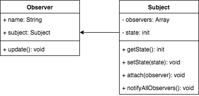

## 观察者模式
- 发布 & 订阅
- 一对N



```js
// 主题，保存状态，状态变化后触发所有观察者对象
class Subject {
  constructor(){
      this.observers = [];
      this.state = 0;
  }
  getState() {
      return this.state;
  }
  setState(state) {
      this.state = state;
      this.notifyAllObservers();
  }
  attach(observer) {
      this.observers.push(observer);
  }
  notifyAllObservers() {
      this.observers.forEach(item => {
          item.update();
      })
  }
}

class Observer {
  constructor(name, subject){
      this.name = name;
      this.subject = subject;
      this.subject.attach(this);
  }
  update() {
      console.log(`${this.name} update, state: ${this.subject.getState()}`);
  }
}

// one vs one
let s = new Subject();
let o1 = new Observer('o1', s);
s.setState(1);  // o1 update, state: 1


// one vs more
let s = new Subject();
let o1 = new Observer('o1', s);
let o2 = new Observer('o2', s);
let o3 = new Observer('o3', s);
s.setState(1);
s.setState(2);
s.setState(3);

/* o1 update, state: 1
o2 update, state: 1
o3 update, state: 1
o1 update, state: 2
o2 update, state: 2
o3 update, state: 2
o1 update, state: 3
o2 update, state: 3
o3 update, state: 3 */

```

### 运用场景
- 网页事件绑定
- promise
- jquery callbacks
- vue和React组件生命周期触发 (发布 & 订阅)
- vue watch
```js
// 事件监听，一对多，易可一对一
$('#btn').on('click', function() {
    console.log('clicked 1');
})
$('#btn').on('click', function() {
    console.log('clicked 2');
})
$('#btn').on('click', function() {
    console.log('clicked 3');
})

// promise
function loadImg(src) {
    var promise = new Promise((resolve, reject) => {
        var img = document.createElement('img');
        img.onload = function() {
            resolve(img);
        }
        img.error = function() {
            reject("图片加载失败");
        }
        img.src = src;
    });
    return promise;
}

var src = 'http://.../test.png';
var result = loadImg(src);
result.then(img => {
    console.log('width', img.width);
    return img;
}).then(img=>{
    console.log('height', img.height);
});

// jquery callbacks
var callbacks = $.Callbacks();
callbacks.add(function(info) {
    console.log('fn1', info);
})
callbacks.add(function(info) {
    console.log('fn2', info);
})
callbacks.add(function(info) {
    console.log('fn3', info);
})
callbacks.fire('gogogo');
```
### 设计原则验证
- 主题和观察者分离，不是主队触发而是被动监听，两者解耦
- 符合开放封闭原则