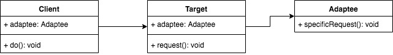

## 适配器模式
- 旧接口格式和使用者不兼容
- 中间加一个适配转换接口



```js
class Adaptee{
    specifcRequest() {
        return '德国标准插头';
    }
}

class Target{
    constructor(){
        this.adpatee = new Adaptee();
    }
    request() {
        let info = this.adpatee.specifcRequest();
        return `${info} - 转换器 - 中国插头`
    }
}

let target = new Target();
let res = target.request();
```

### 运用场景
```js
// 自己封装的ajax
ajax({
    url: '/getData',
    ...
})

// 老版本的ajax没有封装
$.ajax({})

// 通过加一层适配器
var $ = {
    ajax: function(option) {
        return ajax(option)
    }
}
```