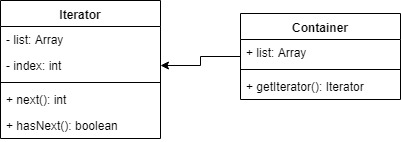

## 迭代器模式
- 顺序访问一个集合
- 使用者无需知道集合的内部结构（封装）



```js

class Container {
  constructor(list) {
      this.list = list;
  }
  getIterator() {
      return new Iterator(this);
  }
}

class Iterator {
  constructor(container) {
      this.list = container.list;
      this.index = 0;
  }
  next() {
      if(this.hasNext()) {
          return this.list[this.index++]
      }
      return null;
  }
  hasNext() {
      if(this.index >= this.list.length) {
          return false;
      }
      return true;
  }
}

let container = new Container([1, 2, 3, 4, 5, 6]);
let iterator = container.getIterator();
while(iterator.hasNext()) {
    console.log(iterator.next())
}
```

### 运用场景
- jquery each
- ES6 Iterator
```js
// 如何能写出一个方法来遍历这三种对象呢？
function each(data) {
    var $data = $(data);    // 生成迭代器
    $data.each(function(key, p) {
        console.log(key, p)
    })
}
each(arr);
each(nodeList);
each($p);
```

#### ES6 Iterator为何存在?
- ES6语法中，有序集合的数据类型已经有很多
- Array Map Set String TypedArray arguments NodeList
- 需要有一个统一的遍历接口来遍历所有数据类型<br>
- (注意，object不是有序集合，可以用Map代替)

#### ES6 Iterator是什么？
- 以上数据类型，都有`[Symbol.iterator]`属性
- 属性值是函数，执行函数返回一个迭代器
- 这个迭代器就有next方法可顺序迭代子元素
- 可运行`Array.prototype[Symbol.iterator]`来测试

```js
// 底层方法
function each(data) {
    // create Iterator
    let Iterator = data[Symbol.iterator]();

    // console.log(Iterator.next()) // 有数据返回 {value: 1, done: false}
    // console.log(Iterator.next()) // 没有数据返回 {value: undefined, done: true}

    let item = {done: false};
    while(item.done) {
        item = iterator.next();
        if(!item.done) {
            console.log(item.value)
        }
    }
}

/* `Symbol.iterator`并不是人人都知道
    也不是每个人都需要封装一个each 方法
    因此有了 `for...of` 语法
 */
 function each(data) {
     for(let item of data) {
         console.log(item)
     }
 }

each(arr);
each(nodeList);
each(map);
```

### 设计原则验证
- 迭代器对象和目标对象分离
- 迭代器将使用者与目标对象隔离开
- 符合开放封闭原则