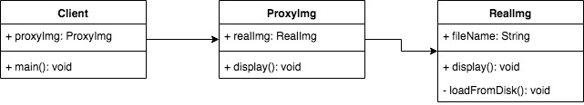

## 代理模式
- 使用者无权访问目标对象
- 中间加代理，通过代理做授权和控制



```js
class RealImg{
    constructor(fileName){
        this.fileName = fileName;
        this.loadFromDisk();
    }
    display() {
        console.log(`loading..... ${this.fileName}`);
    }
    loadFromDisk() {
        console.log(`loading..... ${this.fileName}`);
    }
}

class ProxyImg{
    constructor(fileName){
        this.realImg = new RealImg(fileName);
    }
    display() {
        this.realImg.display();
    }
}

let proxyImg = new ProxyImg("proxy.jpg");
proxyImg.display();
```

### 运用场景
- jquery - $.proxy
- Es6 proxy
```js
// star
let star = {
    name: "John",
    age: 25,
    phone: '13788888888'
}

// agent
let agent = new Proxy(star, {
    get: function(target, key) {
        if(key === 'phone') {
            // return agent phone
            return '12877777777';
        }
        if(key === 'price') {
            return 120000;
        }
        return target[key];
    },
    set: function(target, key, val) {
        if(key === 'customPrice') {
            if(val < 100000) {
                throw new Error('price is too low');
            } else {
                target[key] = val;
                return true;
            }
        }
    }
});
console.log(agent.name)
console.log(agent.age)
console.log(agent.phone)
console.log(agent.price)

agent.customPrice = 150000;
console.log(agent.customPrice)
```
### 区别 
代理模式 vs 适配器模式
- 适配器模式：提供一个不同的接口（如不同版本的插头）
- 代理模式：提供一模一样的接口

代理模式 vs 装饰器模式
- 装饰器模式：扩展功能，原有功能不变且可直接使用
- 代理模式：显示原有功能，但是经过限制的