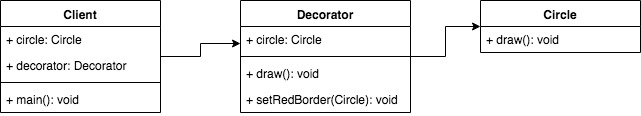

## 装饰器模式
- 为对象添加新功能
- 不改变原有的结构和功能



```js
class Circle{
    draw() {
        console.log('drawing...');
    }
}

class Decorator{
    constructor(circle){
        this.circle = circle;
    }
    draw() {
        this.circle.draw();
        this.setRedBorder(circle);
    }
    setRedBorder(circle) {
        console.log("add red border");
    }
}

let circle = new Circle();

let decorator = new Decorator(circle);
decorator.draw();
```

### 运用场景
- Es7装饰器
- core-decorators