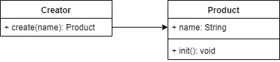

## 工厂模式
- 将new操作单独封装
- 遇到new时，就要考虑是否该使用工厂模式
- 构造函数和创建者分离
- 符合开放封闭原则



```js
class Product {
    constructor(name) {
        this.name = name;
    }
    init() {
        console.log(this.name)
    }
}

class Creator {
    create(name) {
        return new Product(name)
    }
}

let creator = new Creator();
let p = creator.create('p1');
p.init();
```

### 运用场景
- jQuery - $('div')
- React.createElement
- vue 异步组件