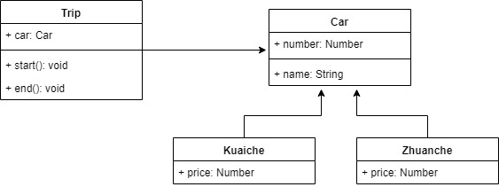
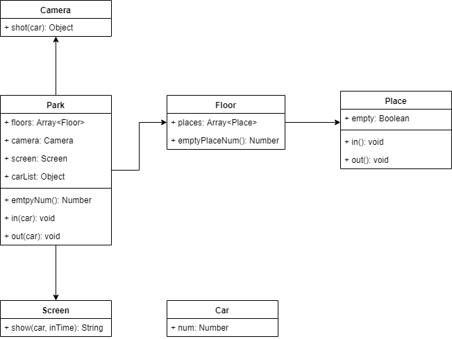

## 设计原则
- 何为设计？
- 五大设计原则
- 从设计到模式
- 23种设计模式

### 何为设计？
描述
- 即按照哪一种思路或者标准来实现功能
- 功能相同，可以有不同的设计方案来实现
- 伴随着需求增加，设计的作用才能体现出来
<br>

《UNIX/LINUX设计哲学》
- 准则1：小即是美
- 准则2：让每个程序只做好一件事
- 准则3：快速建立原型
- 准则4：舍弃高效率而取可移植性
- 准则5：采用纯文本来存储数据
- 准则6：充分利用软件的杠杆效应（软件复用）
- 准则7：使用shell脚本来提高杠杆效应和可移值性
- 准则8：避免强制性的用户界面
- 准则9：让每个程序都称为过滤器

**小准则：**
- 允许用户定制环境
- 尽量使操作系统内核小而轻量化
- 使用小写字母并尽量简写
- 沉默是金
- 各部分之和大于整体
- 寻求90%的解决方案（用20%的成本完成80%的需求）

### S O L I D 五大设计原则
- S - 单一职责原则 
    - 一个程序只做好一件事
    - 如果功能过于复杂就拆分开，每个部分保持独立
- O - 开放封闭原则
    - 对扩展开发，对修改封闭
    - 增加需求时，扩展新代码，而非修改已有代码
    - 这是软件设计的终极目标
- L - 李氏置换原则
    - 子类能覆盖父类
    - 父类能出现的地方子类就能出现
    - JS中使用较少（弱类型&继承使用较少）
- I - 接口独立原则
    - 保持接口的单一独立，避免出现“胖接口”
    - JS中没有接口(TS例外)，使用较少
    - 类似单一职责原则，这里更关注接口
- D - 依赖导致原则
    - 面向接口编程，依赖于抽象而不依赖于具体
    - 使用方只关注接口而不关注具体类的实现
    - JS中使用较少（弱类型&继承使用较少）

**总结：S O 体现较多**

### 从设计到模式
先设计，后模式，分开概念看，最后联系在一起就是“从设计到模式”

### 23种设计模式
- 创建型
    - 工厂模式（工厂方法模式，抽象工厂模式，建造者模式）
    - 单例模式
    - 原型模式
- 结构型
    - 适配器模式
    - 装饰器模式
    - 代理模式
    - 外观模式
    - 桥接模式
    - 组合模式
    - 享元模式
- 行为型
    - 策略模式
    - 模板方式模式
    - 观察者模式（常用）
    - 迭代器模式（常用）
    - 职责链模式
    - 命令模式
    - 备忘录模式
    - 中介者模式
    - 状态模式（一般）
    - 解释器模式
    - 访问者模式

**面试题一：**
- 打车时，可以打专车或者快车。任何车都有车牌号和名称
- 不同车价格不同，快车每公里1元，专车每公里2元
- 行程开始时，显示车辆信息
- 行程结束时，显示打车金额（假定行程就5公里）

1. 画出UML类图
2. 用ES6语法写出该示例




```js
class Car{
    constructor(number, name) {
        this.number = number;
        this.name = name;
    }
}

class Kuaiche extends Car{
    constructor(number, name) {
        super(number, name);
        this.price = 1;
    }
}

class Zhuanche extends Car{
    constructor(number, name) {
        super(number, name);
        this.price = 2;
    }
}

class Trip{
    constructor(car) {
        this.car = car;
    }
    start() {
        console.log(`行程开始，名称：${this.car.name},车牌号：${this.car.number}`);
    }
    end() {
        console.log(`行程结束，价格：${this.car.price * 5}元`);
    }
}

let car = new Kuaiche(100, '奔驰');
let trip = new Trip(car);
trip.start();
trip.end();
```


**面试题二：**
- 某停车场，分3层，每层100车位
- 每个车位都能监控到车辆的驶入和离开
- 车辆进入前，显示每层的空余车位数量
- 车辆进入时，摄像头可识别车牌号和时间
- 车辆出来时，出口显示器显示车牌号和停车时长

1. 画出UML类图
2. 用ES6语法写出该示例

