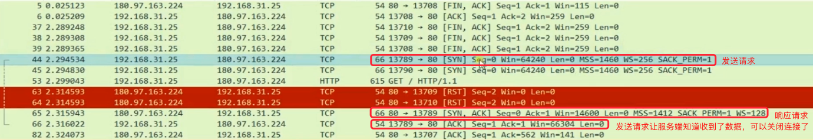

## 网络协议分层

### 低三层
- 物理层：主要作用是定义物理设备如何传输数据
- 数据链路层：在通信的实体间建立数据链路连接
- 网络层：为数据在结点之间传输创建逻辑链路
- 传输层：向用户提供可靠的端到端服务
- 应用层：为应用软件提供了很多服务，构建于TCP协议之上，屏蔽网络传输相关细节
## 三次握手

### 为什么需要三次握手
- 第三次握手让服务端知道客户端有没有接收到数据，确认关闭
- 需要三次握手来确认这个过程，让客户端和服务端能够及时的察觉到因为网络一些原因的问题，导致数据包没查到，这个连接已经关闭了，不需要一直等在那边
- 规避这些网络传输当中延时而导致开销的问题
- 为了防止服务端开启无用的链接
