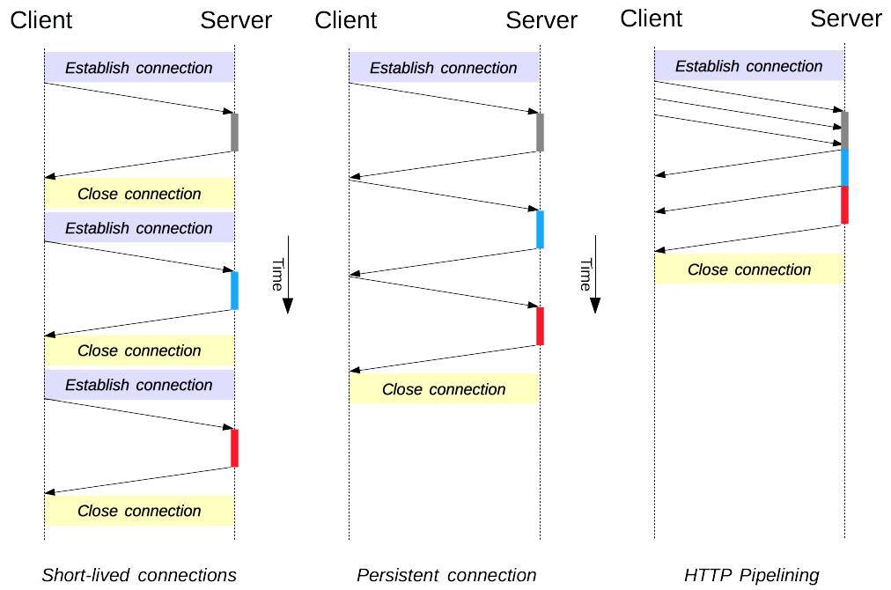

### 短连接
HTTP 最早期的模型，也是  HTTP/1.0 的默认模型，是短连接。每一个 HTTP 请求都由它自己独立的连接完成；这意味着发起每一个 HTTP 请求之前都会有一次 TCP 握手，而且是连续不断的。

TCP 协议握手本身就是耗费时间的，所以 TCP 可以保持更多的热连接来适应负载。短连接破坏了 TCP 具备的能力，新的冷连接降低了其性能。

这是 HTTP/1.0 的默认模型(如果没有指定Connection协议头，或者是值被设置为 close)。而在 HTTP/1.1 中，只有当Connection被设置为close时才会用到这个模型
### 长连接
短连接有两个比较大的问题：创建新连接耗费的时间尤为明显，另外 TCP 连接的性能只有在该连接被使用一段时间后(热连接)才能得到改善。为了缓解这些问题，长连接 的概念便被设计出来了，甚至在 HTTP/1.1 之前。或者这被称之为一个 keep-alive连接。

一个长连接会保持一段时间，重复用于发送一系列请求，节省了新建 TCP 连接握手的时间，还可以利用 TCP 的性能增强能力。当然这个连接也不会一直保留着：连接在空闲一段时间后会被关闭(服务器可以使用Keep-Alive协议头来指定一个最小的连接保持时间)。

长连接也还是有缺点的；就算是在空闲状态，它还是会消耗服务器资源，而且在重负载时，还有可能遭受DoS attacks攻击。这种场景下，可以使用非长连接，即尽快关闭那些空闲的连接，也能对性能有所提升。

HTTP/1.0 里默认并不使用长连接。把Connection设置成 close 以外的其它参数都可以让其保持长连接，通常会设置为 retry-after。

在 HTTP/1.1 里，默认就是长连接的，协议头都不用再去声明它(但我们还是会把它加上，万一某个时候因为某种原因要退回到 HTTP/1.0 呢)。
### HTTP 流水线
默认情况下，HTTP 请求是按顺序发出的。下一个请求只有在当前请求收到应答过后才会被发出。由于会受到网络延迟和带宽的限制，在下一个请求被发送到服务器之前，可能需要等待很长时间。

流水线是在同一条长连接上发出连续的请求，而不用等待应答返回。这样可以避免连接延迟。理论上讲，性能还会因为两个 HTTP 请求有可能被打包到一个 TCP 消息包中而得到提升。就算 HTTP 请求不断的继续，尺寸会增加，但设置 TCP 的MSS(Maximum Segment Size) 选项，仍然足够包含一系列简单的请求。

并不是所有类型的 HTTP 请求都能用到流水线：只有idempotent方式，比如GET、HEAD、PUT和DELETE能够被安全的重试：如果有故障发生时，流水线的内容要能被轻易的重试。

今天，所有遵循 HTTP/1.1 的代理和服务器都应该支持流水线，虽然实际情况中还是有很多限制：一个很重要的原因是，任然没有现代浏览器去默认支持这个功能。
> 不同域会创建新的TCP连接，HTTP1.1的TCP连接发送请求是有先后顺序的，例如有10个请求不能在一个TCP连接上并发的发送，请求是按顺序发出的，下一个请求只有在当前请求收到应答过后才会被发出。浏览器实现了自己的并发限制规则，chorme允许并发6个TCP连接，之后的TCP连接需要等待前面的完成。