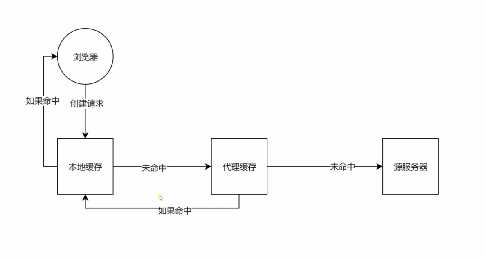

### 有了缓存，不需要从服务端重新获取数据，直接按照下方的逻辑获取

### cache-control: max-age=20, s-maxage=30, private, no-store
- vary: 'X-Test-Cache'
- max-age: 缓存最长秒
- s-maxage:代理服务器缓存最长秒
- private:只有浏览器使用缓存
- no-store:不使用所有缓存
- vary:只有发送请求头里含有X-Test-Cache的值相同才进行缓存