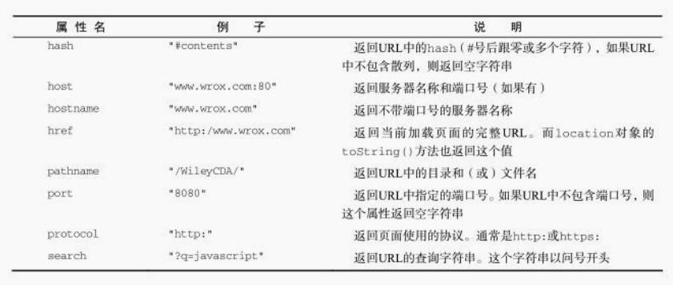

BOM：浏览器对象模型

## 8.1 window对象
BOM的核心对象是window,它表示浏览器的一个实例。在浏览器中，window对象有双重角色，它既是通过JS访问浏览器窗口的一个接口，又是ECMAScript规定的Global对象。这意味着在网页中定义的任何一个对象、变量和函数，都以window作为其Global对象，因此有权访问parseInt()等方法。

### 8.1.4 窗口大小
视口大小：innerWidth、innerHeight<br>
浏览器窗口本身尺寸：outerWidth、outerHeight

### 8.1.6 间隙调用和超时调用
JavaScript是一个单线程序的解释器，因此一定时间内只能执行一段代码。为了控制要执行的代码，就有一个JavaScript任务队列。这些任务会按照将它们添加到队列的顺序执行。setTimeout()的第二个参数告诉JavaScript再过多长时间把当前任务添加到队列中。如果队列是空的，那么添加的代码会立即执行；如果队列不是空的，那么它就要等前面的代码执行完了以后再执行。<br>
调用setTimeout()之后，该方法会返回一个数值ID,表示超时调用。这个超时调用ID是计划执行代码的唯一标识符，可以通过它来取消超时调用。

```js
var timeoutId = setTimeout(function(){
    console.log("Hello world!");
},1000);
clearTimeout(timeoutId);
```
> 超时调用的代码都是在全局作用域中执行的，因此函数中this的值在非严格模式下指向window对象，在严格模式下是undefined

间隙调用

```js
var num = 0,
    max = 10,
    intervalId = null;
function incrementNumber(){
    num ++;
    if(num == max) {
        clearInterval(intervalId);
        alert("done");
    }
}
intervalId = setInterval(incrementNumber, 500);
```
这个例子也可以使用超时调用来实现

```js
var num = 0,
    max = 10;
function incrementNumber(){
    num ++;
    if(num < max) {
        setTimeout(incrementNumber, 500);
    }else{
        alert("done");        
    }
}
setTimeout(incrementNumber, 500);
```
> 使用超时调用来模拟间隙调用的是一种最佳模式，最好不要使用间隙调用

## 8.2 location对象
location是最有用的DOM对象之一，它既是window对象的属性，也是document对象的属性，换句话说，window.location和document.location引用的是同一个对象。



### 8.2.1 查询字符串参数
```js
function getQueryStrngArgs() {
    var qs = (location.search.length > 0 ? location.search.substring(1) : ""),
    args = {},
    items = qs.length ? qs.split("&") : [],
    item = null,
    name = null,
    value = null,
    i = 0,
    len = items.length;

    for(i = 0; i < len; i++){
        item = item[i].split("=");
        name = decodeURIComponent(item[0]);
        value = decodeURIComponent(item[1]);
        
        if(name.length) {
            args[name] = value;
        }
    } 

    return args;
}
// 假设查询字符串是?q=javascript&num=10
var args = getQueryStringArgs();
console.log(args["q"]);    // javascript
console.log(args["num"]);    // 10
```
### 8.2.2 位置操作
下列两行代码与显示调用assign()方法的效果完全一样
```js
window.location = "http://www.baidu.com";
location.href = "http://www.baidu.com";
location.reload() // 重新加载(有可能从缓存中加载)
location.reload(true) // 重新加载(从服务器重新加载)
```

> 位于reload调用之后的代码可能会也可能不会执行，取决于网络延迟或系统资源等因素，最后将reload()放在代码的最后一行

## 8.5 history对象
```js
// 后退一页
history.go(-1);
// 前进一页
history.go(1);
// 前进两页
history.go(2);
// 后退一页
history.back();
// 前进一页
history.forward();
history.length    // 保存这历史纪录的数量
```
> 当页面的URL改变时，就会生成一条历史记录。这里所说的改变包括URL中hash的变化（因此，设置location.hash会在浏览器中生成一条新的历史纪录）