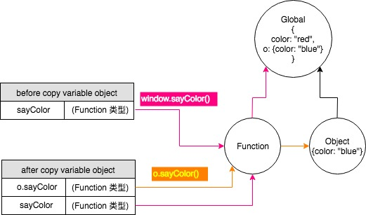

## 5.0 引用类型
一般引用类型：`Object、Function、Array、Date、RegExp`

特殊引用类型：`Boolean、Number、String`

单体内置对象：`Global、Math`
## 5.1 `Object` 类型
创建object实例有两种方式
```javascript
var person = new Object(); // new 操作符后跟Object构造函数
var person1 = {}; // 对象字面量表示法
```
## 5.2 `Array` 类型
创建数组的基本方式有两种方式
```javascript
var list = new Array(); // 使用Array构造函数
var list1 = []; // 数组字面量表示法
```
> 创建数组和对象使用字面量表示法，都不会调用构造函数

### 5.2.2 转换方法
数组继承`toLocaleString()、valueOf()`和`toString()`方法，在默认情况下都会以逗号分隔的字符串的形式返回数组项.
> `join()`方法可以使用不同的分隔符来构建这个字符串

### 5.2.3 重排序方法
`sort()`比较函数接收两个参数，如果第一个参数应该位于第二个之前则返回一个负数，如果两个参数相等则返回0，如果第一个参数应该位于第二个之后则返回一个正数;
```javascript
function compare(value1, value2) {
    if(value1 < value2) {
        return -1;
    } else if (value1 > value2) {
        return 1;
    } else {
        return 0;
    }
}
var values = [0,9,2,4,10];
values.sort(compare);
console.log(values); // [0, 2, 4, 9, 10]
```
对于数值类型或其`valueOf()`方法会返回数值类型的对象类型，可以使用一个更简单的比较函数
```javascript
function compare(value1, value2) {
    return value1 - value2;
}
```
### 5.2.7 位置方法
`indexOf()`和`lastIndexOf()`,接受两个参数：要查找的项和(可选的)表示查找起点位置的索引，底层使用的是全等操作符(===)
```javascript
var person = { name: "Nicholas" },
    people = [{ name: "Nicholas" }],
    morePeople = [person];
console.log(people.indexOf(person)); // -1
console.log(morePeople.indexOf(person));    // 0
```
### 5.2.8 迭代方法
- `every()`：对数组中的每一项运行给定函数，如果该函数对每一项都返回true,则返回true
- `filter()`：对数组中的每一项运行给定函数，返回该函数会返回true的项组成的数组
- `forEach()`：对数组中的每一项运行给定函数，这个方法没有返回值
- `map()`：对数组中的每一项运行给定函数，返回每次函数调用的结果组成的数组
- `some()`：对数组中的每一项运行给定函数，如果该函数对任一项返回true,则返回true
以上方法都不会修改数组中的包含的值
```javascript
var numbers = [1,2,3,4,5];
var mapResult = numbers.map(function(item, index, array){
    return item * 2;
})
console.log(mapResult); // [2, 4, 6, 8, 10]
numbers.forEach(function(item, index, array){
    // 执行某些操作
})
```
## 5.3 Date类型
调用Date构造函数而不传递参数的情况下，新创建的对象自动获得当前日期和时间，如果想根据特定的日期和时间创建日期对象，必须传入表示该日期的毫秒数(即从UTC时间1970年1月1日午夜起至该日期止经过的毫秒数)。为简化计算过程，ECMAScript提供了两个方法：Date.parse()和Date.UTC()

1. Date.parse()方法接收一个表示日期的字符串参数，返回相应日期的毫秒数
2004年5月25日创建一个日期对象：
```javascript
var now = new Date(Date.parse("May 25,2004"));
```
如果传入Date.parse()方法的字符串不能表示日期，那么它会返回NaN.实际上，如果直接将表示日期的字符串传递给Date构造函数，也会在后台调用Date.parse().下面的代码与前面的例子是等价的：
```javascript
var someDate = new Date("May 25, 2004");
```

2. Date.UTC()方法同样返回表示日期的毫秒数，参数分别是年份、基于0的月份（一月是0，二月是1，以此类推）、月中的哪一天（1到31）、小时数（0到23）、分钟、秒以级毫秒数。这些参数中，只有前两个参数（年和月）是必须的。如果没有提供月中的天数，则假设天数为1；如果省略其他参数，则统统假设为0
```javascript
var y2k = new Date(Date.UTC(2000, 0));    // GMT时间2000年1月1日午夜零时
var allFives = new Date(Date.UTC(2005, 4, 5, 17, 55, 55));    // GMT时间2005年5月5日下午5:55:55

var y2k = new Date(2000, 0);    // 本地时间2000年1月1日午夜零时
var allFives = new Date(2005, 4, 5, 17, 55, 55);    // 本地时间2005年5月5日下午5:55:55
```
> Date.now()方法返回表示调用这个方法时的日期和时间的毫秒数

比较日期的方法：

```javascript
var date1 = new Date(2007, 0, 1);
var date2 = new Date(2007, 1, 1);
console.log(data1 < date2)  // true
console.log(data1 > date2)  // false
```
## 5.5 `Function` 类型
每个函数都是Function类型的实例，也拥有属性和方法。由于函数是对象，因此函数名实际上也是一个指向函数对象的指针，不会与某个函数绑定
```javascript
var sum = new Function("num1", "num2", "return num1 + num2"); // 不推荐
```
从技术角度讲，这是一个函数表达式，这种语法对于理解"函数是对象，函数名是指针"的概念很直观.
由于函数名仅仅是指向函数的指针，因此函数名与包含对象指针的其他变量没有什么不同。换句话说，一个函数可能会有多个名字，例如：
```javascript
function sum(num1, num2) {
    return num1 + num2;
}
console.log(sum(10, 10));    // 20
var anotherSum = sum;
console.log(anotherSum(10, 10))    // 20
sum = null;
console.log(anotherSum(10, 10))    // 20
```
```javascript
var obj1 = new Object();
var obj2 = obj1;
obj1.name = "wa";
obj1 = null;
console.log(obj2.name); 	// "wa"
```

**引用类型值：** 当从一个变量向另一个变量复制引用类型的值时，同样也会把该值复制到新变量分配的位置上。不同的是，这个值的副本实际是一个指针，而这个指针指向存储在堆中的一个对象。两个变量将引用同一个对象


上图里的`Object`可以想象成`Function`对象，变量对象可以想像成函数名。JS不允许直接访问内存中的位置，不能直接操作对象的内存空间，不允许修改引用地址，只能修改引用类型的值(或者是指针)

> 使用不带圆括号的函数名是访问函数指针，而非调用函数。此时，`anotherSum`和`sum`的指针都指向了同一个函数(对象)，因此`anotherSum()`也可以调用返回结果，`sum`设置为`null`,就与函数(对象)"断绝关系"，由于`anotherSum`在新变量分配的位置上，它的指针可没有断，所以仍然可以正常调用`anotherSum()`

### 5.5.4 函数内部属性
在函数内部，有两个特殊的对象：`arguments`和`this`

- `arguments`是一个类数组对象，包含着传入函数中的所有参数，这个对象有一个名叫`callee`的属性，该属性是一个指针，指向拥有这个`arguments`对象的函数。例如:
```js
function factorial(num) {
    if(num <= 1){
        return 1;
    } else {
        return num * arguments.callee(num - 1)
    }
}
var trueFactorial = factorial;
factorial = function() {
    return 0;
}
console.log(trueFactorial(5));    // 120
console.log(factorial(5));    // 0
```
> 这样的写法好处在于消除了这个递归函数的执行与函数名`factorial`紧密耦合的现象.
变量`trueFactorial`获得了`factorial`的值，实际上是在另外一个位置上保存了一个函数的指针

函数内部另一个特殊对象是`this`，`this`引用的是函数据以执行的环境对象
```js
window.color = "red";
var o = {color: "blue"};
function sayColor() {
    console.log(this.color);
}
sayColor(); // red
o.sayColor = sayColor;
o.sayColor();    // blue
```
在函数调用之前，`this`的值是不确定的，因为`this`可能会在代码执行过程中引用不同的对象。当在全局作用域中调用`sayColor()`时，`this`引用的是全局对象，对`this.color`求值会转换为`window.color`。当把这个函数赋值给对象`o`并调用`o.sayColor()`时，`this`引用的是对象`o`，`this.color`会转换为`o.color`

> 函数的名字仅仅是一个包含指针的变量而已。因此，即使是在不同的环境中执行，全局的sayColor()函数与o.sayColor()指向的仍然是同一个函数。

