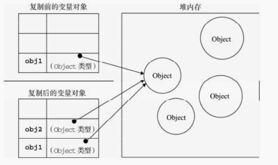
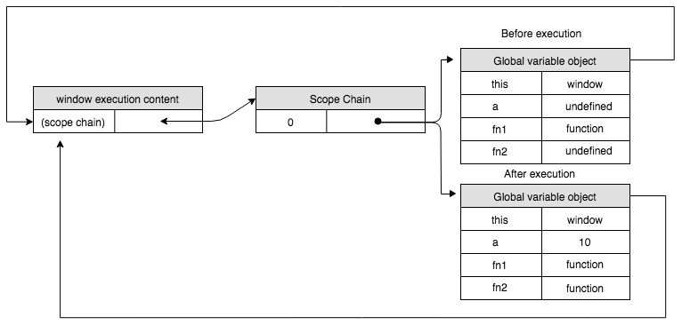
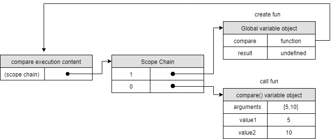
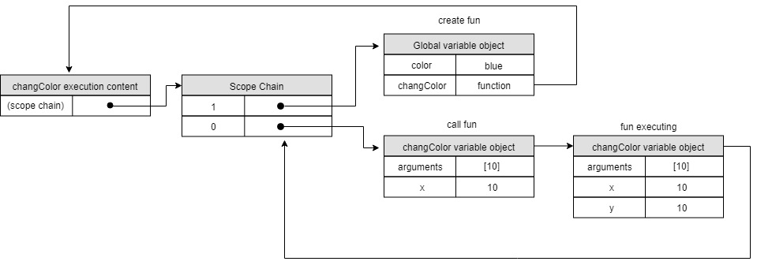
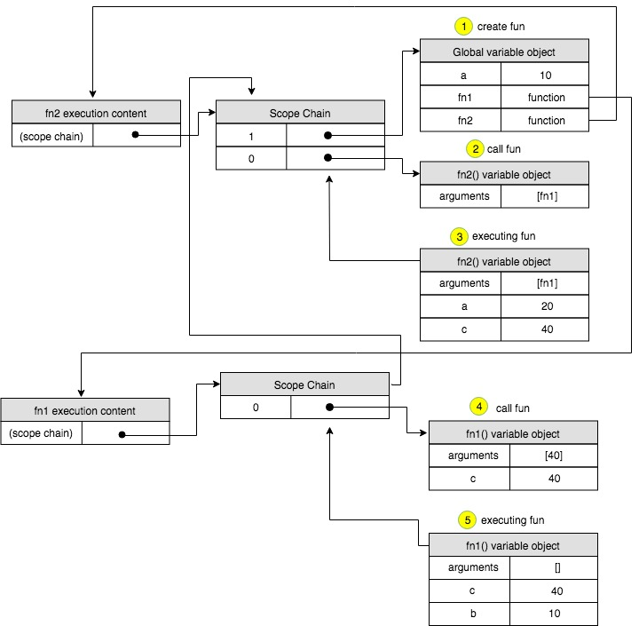

## 4.1 基本类型和引用类型的值
- 基本数据类型是按值访问，操作保存在变量中的实际的值
- 引用类型的值是保存在内存中的对象，JS不允许直接访问内存中的位置，不能直接操作对象的内存空间。为此，引用类型的值是按引用访问的
### 4.1.2 复制变量值
**基本类型值：** 如果从一个变量向另一个变量复制基本类型的值，会在变量对象上创建一个新值，然后把该值复制到新变量分配的位置上
```javascript
var num1 = 5;
var num2 = num1;
```
这两个变量可以相互操作互不影响

复制前的对象

|  变量 | 值 |
| ------------- | ------------- |
| num1  | 5  |

复制后的对象

|  变量 | 值 |
| ------------- | ------------- |
| num2  | 5  |
| num1  | 5  |

**引用类型值：** 当从一个变量向另一个变量复制引用类型的值时(注意这里是"值")，同样也会把该值复制到新变量分配的位置上。不同的是，这个值的副本实际是一个指针，而这个指针指向存储在堆中的一个对象。两个变量将引用同一个对象
```javascript
var obj1 = new Object();
var obj2 = obj1;
obj1.name = "wa";
console.log(obj2.name); 	// "wa"
```



```javascript
var person = new Object();
var obj = person;
obj.name = "name";
obj = new Object();
obj.name = "newName";
console.log(obj.name)         // "newName"
console.log(person.name);     // "name"
```
> 上面我改变了obj的值为新对象(指向了新的引用对象)，并没有改变person的引用，JS不允许直接访问内存中的位置，不能直接操作对象的内存空间，引用类型的值是按引用访问的，不是按引用修改的，是单向的。所以只能操作变量的实际值，明白了吗？再来一个！

```javascript
var person = new Object();
var obj = person;
person.name = "name";
person = null;  // 指针断开不影响obj
console.log(obj.name);     // "name"
```

### 4.1.3 传递参数
ECMAScript中的所有函数的参数都是按值传递，访问变量有按值和按引用两种方式，而参数只能按值传递

在向参数传递基本类型的值时，被传递的值会被复制给一个局部变量。在向参数传递引用数据类型的值时，会把这个值在内存中的地址复制给一个局部变量
```javascript
function setName(obj) {
    // 此处省略了 var obj = person;
    obj.name = "name";
    obj = new Object();
    obj.name = "newName";
}
var person = new Object();
setName(person);
console.log(person.name)	// name
```
如果person是按引用传递的，那么person就会自动被修改为其name属性值为"newName"的新对象，但是，最后显示的值仍然是name,这说明即时在函数内部修改了参数的值，但原始的引用仍然保持不变.实际上，当在函数内部重写obj时，这个变量引用是一个局部对象。而局部变量会在函数调用完毕时出栈立即被销毁释放内存.

## 4.2 执行环境及作用域

执行环境定义了变量或函数有权访问的其他数据，决定了它们各自的行为。

每个执行环境都有一个表示变量的对象 — **变量对象**。 环境中定义的所有变量和函数都保存在这个对象中。虽然无法访问这个对象，但解析器在处理数据时会在后台使用它

全局环境的变量对象始终存在，而像函数这样的局部环境的变量对象，则只在函数执行过程中存在。在创建函数或自由变量时，会创建一个预先包含全局变量对象的**作用域链**，这个作用域链被保存在内部`[[Scope]]`属性中，作用域链的用途，是保证对执行环境有权访问的所有变量和函数的有序访问。作用域链的前端，始终都是当前代码所在环境的变量对象。

```js
console.log(this);  // window

console.log(a); // undefined
var a = 10;

console.log(fn1)    // function
function fn1() {};  // 函数声明

console.log(fn2);   // undefined
var fn2 = function() {};    // 函数表达式

----------------------------------------------------------------------------- // 上面的代码也可以拆分为像下面这样

var a;  // 执行环境产生的，变量对象为window -- window.a = undefined
-----------------------------------------------------------------
// 语句开始执行
console.log(a); // undefined
a = 10; // 赋值

window.fn1 = function() {};   // 执行环境产生的，window.fn1 = function() {};
--------------------------------------------------------------------------
// 语句开始执行
console.log(fn1)    // function
function fn1() {};  // 函数声明

var fn2;    // 执行环境产生的，window.fn2 = undefined
----------------------------------------------------
// 语句开始执行
console.log(fn2);   // undefined
var fn2 = function() {};    // 函数表达式
```


> 上文演示是全局执行环境，与之关联的变量对象为`window`对象，因此所有全局变量和函数都是作为`window`对象的属性和方法创建的。
**全局执行环境直到应用程序退出——例如关闭网页或浏览器时，变量和函数定义才会被销毁**

总结一下，在全局执行环境中完成了哪些工作：

- 变量、函数表达式 — 变量声明，默认赋值为undefined；
- this — 赋值；
- 函数声明 — 赋值；

**如果执行环境是函数**
```js
function compare(value1, value2) {
    if(value1 < value2) {
        return -1;
    } else if (value1 > value2) {
        return 1;
    } else {
        return 0;
    }
}
var result = compare(5, 10);
```



> 在创建`compare`函数和`result`变量时，会创建一个预先包含全局变量对象的作用域链，这个作用域链被保存在内部`[[Scope]]`属性中，当调用`compare`函数时，会为函数创建一个执行环境，然后通过复制函数`[[Scope]]`属性中的对象构建起执行环境的作用域链。此后，又有一个活动对象(变量对象)被创建并推入执行环境作用域链的前端。在上方的例子中，`compare`函数的作用域链包含两个变量对象： **局部变量对象和全局变量对象**

```js
var color = "blue";
function changeColor(x) {
    var y = x; // 通过作用域查找，去读取和写入变量的值
    console.log(arguments);
    console.log(y);
    console.log(color);
}
changeColor(10);
```



> `changeColor`函数第一次被调用时(还未真正执行)，会创建一个执行环境及相对应的作用域链，并把作用域链赋值给一个特殊的内部属性`[[Scope]]`，然后，使用this、arguments和x参数的值来初始化函数的活动对象
`changeColor`函数执行过程中，作用域已经确定了。为读取和写入变量y的值，就需要在作用域链中查找变量x的值，复制给一个局部变量y，最后在作用域中查找到了，然后赋值10；读取arguments的值，直接在作用域最前端找到了；读取color的值在作用域最后一个变量对象找到


```js
var a = 10;
function fn1(c) {
    var b = a;
    console.log(b); // 10
    console.log(c); // 40
}

function fn2(fn) {
    var a = 20;
    var c = 40;
    fn(c);
}

fn2(fn1);
```


> 对于上方的例子，`fn1()`的作用域链中包含3个变量对象：自身的变量对象、`fn2`的变量对象、全局变量对象.`fn1()`的局部环境开始时会先在自己的变量对象中搜索变量和函数名，如果搜索不到则再搜索上一级局部作用域链中的标识符`(scope-chain[0])`，搜索全局自由变量`a`时始终是从函数定义的地方开始找`(scope-chain[1])`。`fn2`的作用域链只包含两个对象：它自己的变量对象和全局变量对象。它不能访问`fn1()`的环境。

------------

**小结：**
- 基本类型值在内存中存放在栈内存中;
- 引用类型的值是对象，保存在堆内存中;


