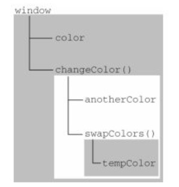

## 4.1 基本类型和引用类型的值
- 基本数据类型是按值访问，操作保存在变量中的实际的值
- 引用类型的值是保存在内存中的对象，JS不允许直接访问内存中的位置，不能直接操作对象的内存空间。为此，引用类型的值是按引用访问的
### 4.1.2 复制变量值
**基本类型值：** 如果从一个变量向另一个变量复制基本类型的值，会在变量对象上创建一个新值，然后把该值复制到新变量分配的位置上
```javascript
var num1 = 5;
var num2 = num1;
```
这两个变量可以相互操作互不影响

复制前的对象

|  变量 | 值 |
| ------------- | ------------- |
| num1  | 5  |

复制后的对象

|  变量 | 值 |
| ------------- | ------------- |
| num2  | 5  |
| num1  | 5  |

**引用类型值：** 当从一个变量向另一个变量复制引用类型的值时(注意这里是"值")，同样也会把该值复制到新变量分配的位置上。不同的是，这个值的副本实际是一个指针，而这个指针指向存储在堆中的一个对象。两个变量将引用同一个对象
```javascript
var obj1 = new Object();
var obj2 = obj1;
obj1.name = "wa";
console.log(obj2.name); 	// "wa"
```


```javascript
var person = new Object();
var obj = person;
obj.name = "name";
obj = new Object();
obj.name = "newName";
console.log(obj.name)         // "newName"
console.log(person.name);     // "name"
```
> 上面我改变了obj的值为新对象(指向了新的引用对象)，并没有改变person的引用，JS不允许直接访问内存中的位置，不能直接操作对象的内存空间，引用类型的值是按引用访问的，不是按引用修改的，是单向的。所以只能操作变量的实际值，明白了吗？再来一个！

```javascript
var person = new Object();
var obj = person;
person.name = "name";
person = null;  // 指针断开不影响obj
console.log(obj.name);     // "name"
```

### 4.1.3 传递参数
ECMAScript中的所有函数的参数都是按值传递，访问变量有按值和按引用两种方式，而参数只能按值传递

在向参数传递基本类型的值时，被传递的值会被复制给一个局部变量。在向参数传递引用数据类型的值时，会把这个值在内存中的地址复制给一个局部变量
```javascript
function setName(obj) {
    // 此处省略了 var obj = person;
    obj.name = "name";
    obj = new Object();
    obj.name = "newName";
}
var person = new Object();
setName(person);
console.log(person.name)	// name
```
如果person是按引用传递的，那么person就会自动被修改为其name属性值为"newName"的新对象，但是，最后显示的值仍然是name,这说明即时在函数内部修改了参数的值，但原始的引用仍然保持不变.实际上，当在函数内部重写obj时，这个变量引用是一个局部对象。而局部变量会在函数调用完毕时出栈立即被销毁释放内存.

## 4.2 执行环境

**javascript在执行代码段之前，都会生成代码段所相对应的执行环境。** 执行环境定义了变量或函数有权访问的其他数据，决定了它们各自的行为。

每个执行环境都有一个与之关联的**变量对象**，环境中定义的所有变量和函数都保存在这个对象中。虽然无法访问这个对象，但解析器在处理数据时会在后台使用它

总体流程：javascript在执行代码段之前，会先生成该代码段所在的执行环境(自动关联一个变量对象)，然后创建该变量对象的一个**作用域链**。 作用域链的用途，是保证对执行环境有权访问的所有变量和函数的有序访问。作用域链的前端，始终都是当前代码所在环境的变量对象。

```js
console.log(this);  // window

console.log(a); // undefined
var a = 10;

console.log(fn1)    // function
function fn1() {};  // 函数声明

console.log(fn2);   // undefined
var fn2 = function() {};    // 函数表达式

----------------------------------------------------------------------------- // 上面的代码也可以拆分为像下面这样

var a;  // 执行环境产生的，变量对象为window -- window.a = undefined
-----------------------------------------------------------------
// 语句开始执行
console.log(a); // undefined
a = 10; // 赋值

window.fn1 = function() {};   // 执行环境产生的，window.fn1 = function() {};
--------------------------------------------------------------------------
// 语句开始执行
console.log(fn1)    // function
function fn1() {};  // 函数声明

var fn2;    // 执行环境产生的，window.fn2 = undefined
----------------------------------------------------
// 语句开始执行
console.log(fn2);   // undefined
var fn2 = function() {};    // 函数表达式
```
> 上方演示是全局执行环境，与之关联的变量对象为`window`对象，因此所有全局变量和函数都是作为`window`对象的属性和方法创建的。
**全局执行环境直到应用程序退出——例如关闭网页或浏览器时，变量和函数定义才会被销毁**

总结一下，在执行环境中完成了哪些工作：

- 变量、函数表达式 — 变量声明，默认赋值为undefined；
- this — 赋值；
- 函数声明 — 赋值；

## 4.3 执行环境及作用域
执行环境定义了变量或函数有权访问的其他数据，决定了它们各自的行为。每个执行环境都有一个与之关联的**变量对象**，环境中定义的所有变量和函数都保存在这个对象中。虽然无法访问这个对象，但解析器在处理数据时会在后台使用它

全局执行环境被认为是`window`对象，因此所有全局变量和函数都是作为`window`对象的属性和方法创建的。某个执行环境中的所有代码执行完毕后，该环境被销毁，保存在其中的所有变量和函数定义也随之销毁**全局执行环境直到应用程序退出——例如关闭网页或浏览器时才会被销毁**

每个函数都有自己的**执行环境**。当执行流进入一个函数时，函数的环境就会推入一个环境栈中。函数执行后，栈将其环境推出，把控制权返回给之前的执行环境。ECMScript程序中的执行流就是这个机制控制的。

当代码在一个环境中执行时 **(可以看作是变量或函数定义的时候)**，会创建变量对象的一个**作用域链**。作用域链的用途，是保证对执行环境有权访问的所有变量和函数的有序访问。作用域链的前端，始终都是当前执行的代码所在环境的变量对象。如果这个环境是函数，则将其**活动对象**作为变量对象，最开始时只包含一个变量，即`arguments`对象，下一个变量对象来自包含(外部)环境，再下一个变量对象来自下一个包含环境。这样，一直延续到全局执行环境；**全局执行环境的变量对象始终都是作用域链中的最后一个对象。**

> 标识符解析 **(也就是变量赋值的时候)** 是沿着作用域链一级一级地搜索标识符的过程。搜索过程始终从作用域链的前端开始，然后逐级地向后回溯，直至找到标识符为止
```js
var color = "blue";
function changeColor() {
    console.log(color);
}
changeColor();
```
函数`changeColor()`作用域链包含2个变量对象：它自己的变量对象（arguments）和全局环境的变量对象。可以在函数内部访问变量color，就是因为可以在通过访问作用域中全局环境的变量对象找到window.color属性

```js
var color = "blue";
function changeColor() {
    var anotherColor = "red";
    function swapColors() {
        var tempColor = anotherColor;
        anotherColor = color;   
        color = tempColor;   
        console.log(tempColor)  // red
    }
    swapColors();
    console.log(anotherColor)   // blue
}
changeColor();
console.log(color)  // red
```



上图的矩形表示特定的执行环境。其中，内部环境可以通过作用域链访问所有的外部环境，但外部环境不能访问内部环境中的任何变量和函数。这些环境之间的联系是线性的、有次序的。每个环境都可以向上搜索作用域链，以查询变量和函数名；但任何环境都不能通过向下搜索作用域链而进入另一个执行环境。对于上方的例子，`swapColors()`的作用域链中包含3个变量对象：自身的变量对象、`changeColor()`的变量对象、全局变量对象.`swapColors()`的局部环境开始时会先在自己的变量对象中搜索变量和函数名，如果搜索不到则再搜索上一级作用域链。`changeColor()`的作用域链只包含两个对象：它自己的变量对象和全局变量对象。它不能访问`swapColors()`的环境。


------------

**小结：**
- 基本类型值在内存中存放在栈内存中;
- 引用类型的值是对象，保存在堆内存中;
