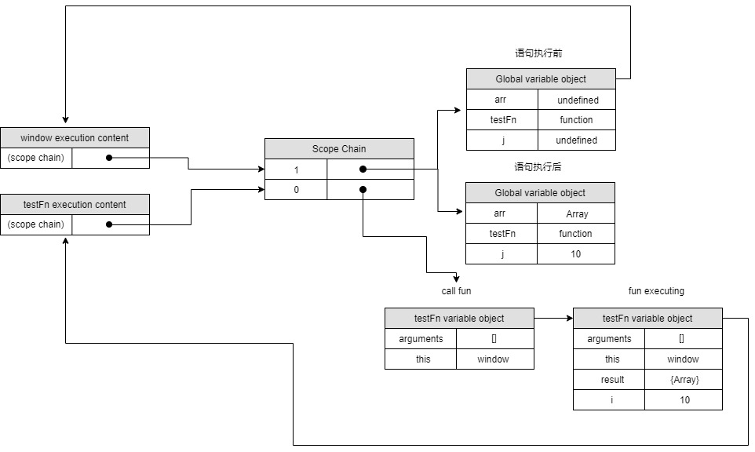

## 7.2 闭包
闭包是指有权访问另一个函数作用域中的变量的函数。

### 7.2.1 闭包与变量
作用域链的这种配置机制引出了一个值得注意的副作用，即闭包只能取得包含函数(外部函数)中任何变量的最后一个值

```js
function testFn () {
    var result = new Array(),i;
    for (i = 0; i < 10; i++) {
        result[i] = function () {
            return i;
        }
    }
    return result;
}
/**
var i = 0;
function demo1() {
    return i;
}
i = 2;
function demo2() {
    return i;
}

console.log(demo1());   // 2
console.log(demo2());   // 2
**/
var arr = testFn();  
for (var j = 0; j < arr.length; j++) {
    console.log(arr[j]());    // 全部是10
}
```


对于上方的例子，数组中的匿名函数的作用域链中包含3个变量对象：自身的变量对象、testFn的变量对象、全局变量对象.搜索自由变量i时始终是从函数定义的地方开始找(scope-chain[0])，自身没有找到会去找testFn的变量对象，找到了是10，所以打印10

通过创建另一个匿名函数强制让闭包的行为符合预期：
```js
function createFunctions() {
    var result = new Array();
    for (var i = 0; i < 10; i++) {
        /* 这段代码也可以
        (function(num){
            result[num] = function() {
                return num;
            };
        })(i)
         */
        result[i] = function (num) {
            return function () {
                return num;
            };
        }(i);
    }
    return result;
}

var arr = createFunctions();
for (var j = 0; j < arr.length; j++) {
    console.log(arr[j]());  
}
```
在调用每个匿名函数时，传入了变量i。由于函数传参是按值传递的，这里传递的是i，属于基本类型的值，被传递的值会被复制给一个局部变量num,就算在匿名函数内部改变num的值，也不会影响外部函数的i变量。而在这个匿名函数内部，又创建并返回了一个访问num的闭包，这样一来，result数组中的每个函数都有自己num变量的一个副本，因此就可以返回各自不同的数值了。

### 7.2.2 关于this对象
this对象是在运行时基于函数的执行环境绑定的：在全局函数中，this等于window，而当函数被作为某个对象的方法调用时，this等于那个对象。不过匿名函数的执行环境具有全局性，因此其this对象通常指向window.

```js
var name = "The Window";
var object = {
    name: "My Object",
    getNameFunc: function(){
        return function() {
            return this.name;
        }
    }
}
console.log(object.getNameFunc()());    // "The Window"
```
每个函数在被调用时，其活动对象都会自动取得两个特殊变量：this和arguments.内部函数在搜索这两个变量时，只会搜索到其活动对象为止，因为永远不可能直接访问外部函数中的这两个变量(本身已经有了)。不过，把外部作用域中this对象保存在一个闭包能够访问到的变量里，就可以让闭包访问该对象了。

```js
var name = "The Window";
var object = {
    name: "My Object",
    getNameFunc: function(){
        var that = this;
        return function() {
            return that.name;
        }
    }
}
console.log(object.getNameFunc()());    // "My Object"
```
## 7.3 模仿块级作用域
```js
function outputNumbers(count) {
    (function(){
        // 这里是块级作用域
        for(var i = 0; i < count; i++) {
            console.log(i);
        }
        console.log(i);
    })();
    console.log(i); // 导致一个错误！
}
```
在匿名函数中定义的任何变量，都会在执行结束时被销毁。因此，变量i只能在匿名函数内访问，使用后即被销毁，而且私有作用域中能够访问变量count,是因为这个匿名函数是一个闭包，它能够访问包含作用域中的所有变量

```js
(function(){
    var now = new Date();
    if(now.getMonth() == 0 && now.getDate() == 1){
        console.log("Hello World");
    }
})();
// 这段代码放在全局作用域中，变量now现在是匿名函数的局部变量，不必在全局作用域中创建它；
```
> 这种做法可以减少闭包占用的内存问题，因为没有指向匿名函数的引用。只要函数执行完毕，就可以立即销毁其作用域链了。

## 7.4.2 模块模式
```js
var singleton = function(){
    // 私有变量和私有函数
    var privateVariable = 10;
    function privateFunction() {
        return false;
    }
    // 特权/公有方法和属性
    return {
        publicProperty: true,
        publicMethod: function(){
            privateVariable++;
            return privateFunction();
        }
    };
}();
```
**小结：**

- 函数表达式不同于函数声明。函数声明要求有名字，但函数表达式不需要。没有名字的函数表达式也叫做匿名函数
- 递归函数应该始终使用arguments.callee来递归调用自身，不要使用函数名—函数名可能会发生变化
**当在函数内部定义了其他函数时，并访问了外部函数的变量，就创建了闭包。原理如下：**
- 在后台执行环境中，闭包的作用域链包含着它自己的作用域、包含函数的作用域和全局作用域。
- 通常，函数的作用域及其所有变量都会在函数执行结束后被销毁。
- 但是，当使用闭包时，这个函数的作用域将会一直在内内中保存到闭包不存在为止。
**使用闭包可以在JS中模仿块级作用域**
- 创建并立即调用一个函数，这样既可以执行其中的代码，又不会在内存中留下对该函数的引用。
- 结果就是函数内部的所有变量都会被立即销毁—除非将某些变量赋值给了外部作用域中的变量(也就是引用了外部的变量啦)。