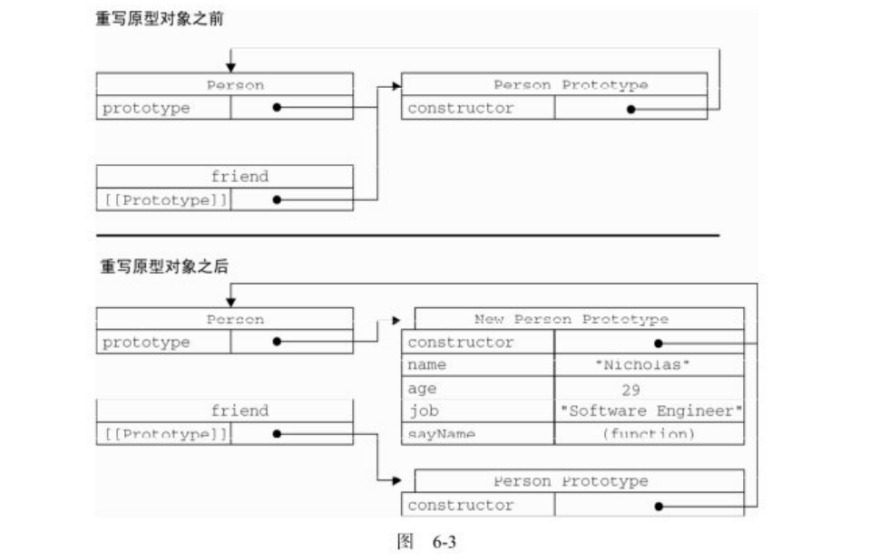
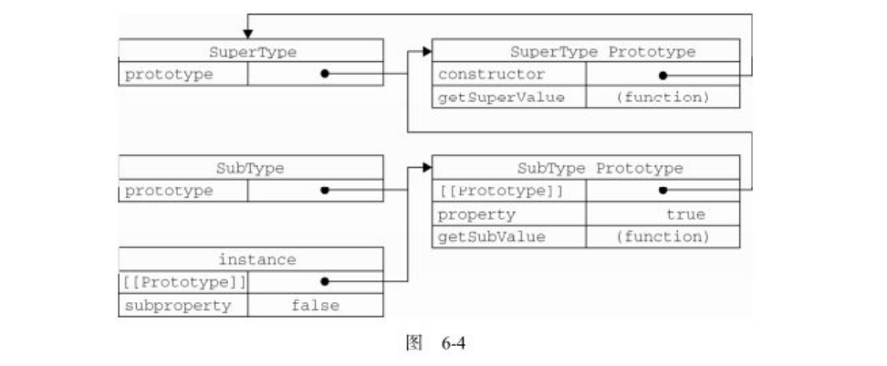
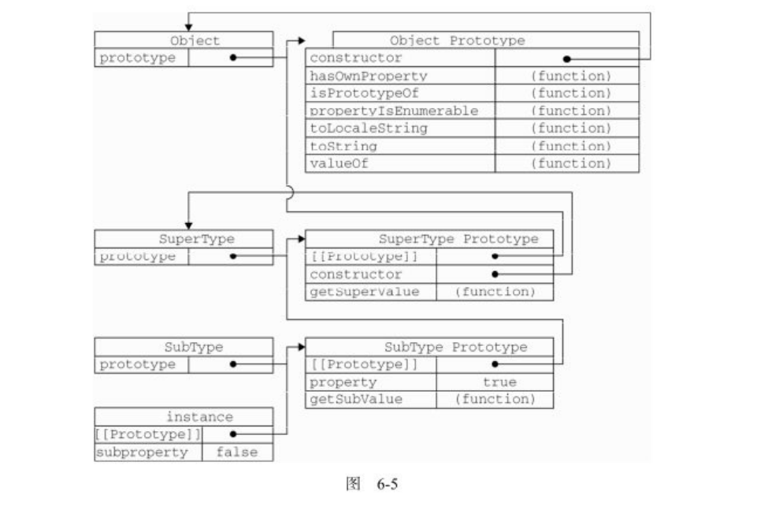

## 我们可以把ECMAScript的对象想象成散列表：无非就是一组名值对，其中值可以是数据或函数.每个对象都是基于一个引用类型创建的

## 6.1.1 属性类型
只有内部采用的特性时，描述了属性（prototype）的各种特征。为了表示特性的内部值，该规范把它们放在了两对儿方括号中：[[]]
```js
var person = {
    name: "Nicholas"
};
```
ECMAScript中有两种属性：数据属性和访问器属性

1. 数据属性
数据属性包含一个数据值的位置。在这个位置可以读取和写入值。数据属性有4个描述其行为的特性：
- [[Configurable]]：表示能否通过delete删除属性从而重新定义属性，能否修改属性的特性，或者能否把属性修改为访问器属性，对于直接在对象上定义的属性，默认值为true
- [[Enumerable]]：表示能否通过for-in循环返回属性，对于直接在对象上定义的属性，默认值true
- [[Writable]]：表示能否修改属性的值，对于直接在对象上定义的属性，默认值true
- [[value]]：包含这个属性的数据值。读取属性值的时候，从这个位置读，写入属性值的时候，把新值保存在这个位置.默认值为undefined
```js
var person = {
    name: "Nicholas"
};
```
> 这里创建了一个名为name的属性，为它指定的值"Nicholas"，[[Value]]特性将被设置为"Nicholas"，而对这个值的任何修改都将反映在这个位置

要修改属性默认的特性，必须使用ECMAScript 5的Object.defineProperty()方法。这个方法接收三个参数：属性所在的对象、属性的名字和一个描述符对象。其中，描述符对象的属性必须是：Configurable、Enumerable、Writable、value，设置其中的一或多个值，可以修改对应的特性值：例如：

```js
var person = {};
Object.defineProperty(person, "name", {
    writable: false,
    value: "Nicholas"
})
console.log(person.name)    // "Nicholas"
person.name = "Greg";
console.log(person.name)    // "Nicholas"
```
> 在调用Object.defineProperty()方法时，如果不指定，Configurable、Enumerable、Writable特性的默认值都是false

2. 访问器属性
在读取访问器属性时，会调用getter函数，这个函数负责返回有效的值；在写入访问器属性时，会调用setter函数并传入新值，这个函数负责决定如何处理数据。有如下4个特性：
- [[Configurable]]：表示能否通过delete删除属性从而重新定义属性，能否修改属性的特性，或者能否把属性修改为数据属性，对于直接在对象上定义的属性，默认值为true
- [[Enumerable]]：表示能否通过for-in循环返回属性，对于直接在对象上定义的属性，默认值true
- [[Get]]：在读取属性时调用的函数。默认值为undefined
- [[Set]]：在写入属性时调用的函数。默认值为undefined
访问器属性不能直接定义，必须使用Object.defineProperty()来定义。
```js
var book = {
    _year: 2004,
    edition: 1
};
Object.defineProperty(book, "year", {
    get: function() {
        return this._year;
    },
    set: function(newValue) {
        if(newValue > 2004) {
            this._year = newValue;
            this.edition += newValue - 2004;
        }
    }
})
book.year = 2005;
console.log(book.edition)    // 2
```

### 6.1.2 定义多个属性
Object.defineProperties()：接收两个对象参数，第一个对象是要添加和修改其属性的对象，第二个对象的属性与第一个对象中要添加或修改的属性一一对应：例如

```js
var book = {};
Object.defineProperties(book, {
    _year: {
        value: 2004
    },
    edition: {
        value: 1
    },
    year: {
        get: function() {
            return this._year;
        },
        set: function(newValue) {
            if(newValue > 2004) {
                this._year = newValue;
                this.edition += newValue - 2004;
            }
        }
    }
})
```
### 6.1.3 读取属性的特性
Object.getOwnPropertyDescriptor()：可以取得给定属性的描述符，接收两个参数，属性所在的对象和要读取其描述符的属性名称。返回值是一个对象，如果是访问器属性，这个对象的属性有Configurable、Enumerable、get、set；如果是数据属性，这个对象的属性有Configurable、Enumerable、writable和value.例如：

```js
var book = {};
Object.defineProperties(book, {
    _year: {
        value: 2004
    },
    edition: {
        value: 1
    },
    year: {
        get: function() {
            return this._year;
        },
        set: function(newValue) {
            if(newValue > 2004) {
                this._year = newValue;
                this.edition += newValue - 2004;
            }
        }
    }
});
var descriptor = Object.getOwnPropertyDescriptor(book, "_year");
console.log(descriptor.value)    // 2004
console.log(descriptor.configurable)    // false
console.log(typeof descriptor.get)    // undefined

var descriptor = Object.getOwnPropertyDescriptor(book, "year");
console.log(descriptor.value)    // undefined
console.log(descriptor.enumerable)    // false
console.log(typeof descriptor.get)    // function
```
对于数据属性_year,value等于最初的值，configurable是false，而get等于undefined。对于访问器属性year，value等于undefined,enumerable是false，而get是一个指向getter函数的指针。

> 任何对象——包括DOM和BOM对象，都可以使用Object.getOwnPropertyDescriptor()方法

### 6.2.2 构造函数模式
```js
function Person(name, age, job) {
    this.name = name;
    this.sayName = function() {
        console.log(this.name)
    }
}
var person1 = new Person("wa");
var person2 = new Person("wow");
// 这两个对象都有一个constructor(构造函数)属性，该属性指向Person
console.log(person1.constructor == Person) // true
console.log(person2.constructor == Person) // true
// 对象的constructor属性最初是用来标识对象类型的。检测对象还是用instanceof
console.log(person1 instanceof Object) // true
console.log(person1 instanceof Person) // true
console.log(person2 instanceof Object) // true
console.log(person2 instanceof Person) // true
```

> person1和person2之所以同时是Object的实例，是因为所有对象均继承自Object
以这种方式定义的构造函数是定义在Global对象(在浏览器中是window对象)中的

构造函数模式虽然好用，但也并非没有缺点。使用构造函数的主要问题，就是每个方法都要在每个实例上重新创建一遍。在上面的例子中，person1和person2都有一个名为sayName()的方法，但那两个方法不是同一个Function的实例。每定义一个函数，也就是实例化了一个对象。此时的构造函数也可以这样定义。

```js
function Person(name, age, job) {
    this.name = name;
    this.sayName = new Function("console.log(this.name)");    // 与声明函数在逻辑上是等价的
}
```
不同实例上的同名函数是不相等的，指针指向的引用地址不同
`console.log(person1.sayName == person2.sayName ) // false`

### 6.2.3 原型模式
我们创建的每一个函数都有一个prototype(原型)属性，这个属性是一个指针，指向一个对象。通俗的说：prototype就是通过调用构造函数而创建的对象实例的原型对象，好处是让所有对象实例可以共享它所包含的属性和方法，不必在构造函数内定义对象实例的信息，可以在外将信息添加到原型对象中
```js
function Person() {
}
Person.prototype.name = "Nic";
Person.prototype.age = 21;
Person.prototype.sayName = function() {
    console.log(this.name);
}
var person1 = new Person();
person1.sayName();    // Nic
```

**理解原型对象**
- 只要创建一个新函数，就会为该函数创建一个prototype属性，这个属性指向函数的原型对象(Person.prototype就是一个对象)。在默认情况下，所有原型对象都会自动获得一个constructor(构造函数)属性，Person.prototype.constructor指向Person。而通过这个构造函数，可以继续为原型对象添加其他属性和方法；
- 创建了自定义的构造函数之后，其原型对象(Person.prototype)默认只会取得constructor属性；至于其他方法，则从Object继承而来的。当调用构造函数创建一个新实例后，该实例的内部将包含一个指针(内部属性)，指向构造函数(Person)的原型对象，这个指针叫[[prototype]]，浏览中叫__proto__;
> 重要的一点是：这个连接存在于实例与构造函数的原型对象之间，而不是存在于实例与构造函数之间


图6-1展示了Person构造函数、Person的原型属性以及Person现有的两个实例之间的关系。
在此，Person.prototype指向了原型对象，而Person.prototype.constructor又指回了Person.原型对象中除了包含constructor属性之外，还包括后来添加的其他属性。Person的每个实例——person1和person2都包含一个内部属性，该属性仅仅指向了Person.prototype;换句话说，它们与构造函数没有直接关系.
```js
console.log(Person.prototype.isPrototypeOf(person1)) // true
console.log(Person.prototype.isPrototypeOf(person2)) // true
```

> 都有一个指向Person.prototype的指针，返回了true

ECMAScript 5增加了一个新方法，叫Object.getPrototypeOf(),这个方法返回[[Prototype]]的值，例如：
```js
console.log(Object.getPrototypeOf(person1) == Person.prototype); // true
console.log(Object.getPrototypeOf(person1).name); // "Nicholas"
```

> 第一行代码只是确定Object.getPrototypeOf()返回的对象实际就是这个对象的原型。
第二行代码取得了原型对象中name属性的值,利用Object.getPrototypeOf()可以取得一个对象的原型

每当代码读取某个对象的某个属性时，都会执行一次搜索：

> 搜索首先从对象实例本身开始，如果在实例中找到了具有给定名字的属性，则返回该属性的值；
如果没有找到，则继续搜索指针指向的原型对象，如果在原型对象中找到了这个属性，则返回该属性的值

虽然可以通过对象实例访问保存在原型中的值，但却不能通过对象实例重写原型中的值。如果在实例中添加了一个属性，而该属性与实例原型中一个属性同名，那我们就在实例中创建该属性，该属性会屏蔽原型中的那个属性，例如：

```js
function Person() {
}
Person.prototype.name = "Nic";
Person.prototype.age = 21;
Person.prototype.sayName = function() {
    console.log(this.name);
}
var person1 = new Person();
var person2 = new Person();
person1.name = "Greg";
console.log(person1.name);    // Greg ——来自实例
console.log(person2.name);    // Nic ——来自原型
```
> 当为对象实例添加一个属性时，这个属性就会屏蔽原型对象中保存的同名属性。不过，使用delete操作符可以完全删除实例属性，从而让我们重新访问原型中的属性

使用hasOwnProperty()方法可以检测一个属性是存在于实例中，还是存在于原型中，这个方法只在给定属性存在于对象实例中时，才会返回true

```js
console.log(person1.hasOwnProperty("name"));    // true
console.log(person2.hasOwnProperty("name"));    // false
for(var prop in person1) {
    if(person1.hasOwnProperty(prop)){
        console.log(person1[prop]);    // Greg
    }
}
var keyList = Object.keys(Person.prototype)    // 获取对象上所有可枚举的实例属性
console.log(keyList);    // ["name", "age", "sayName"]
var p1Keys = Object.keys(person1);           // 获取对象上所有可枚举的实例属性
console.log(p1Keys);    // ["name"]
var keys = Object.getOwnPropertyNames(Person.prototype);    // 获取对象上所有的实例属性,无论是否可枚举
console.log(keys);    // ["constructor", "name", "age", "sayName"]
```

**更简单的原型语法**
```js
function Person(){}
Person.prototype = {
    name: "Nics",
    age: 24,
    sayName: function() {
        console.log(this.name);
    }
}
```
上面代码中，Person.prototype设置为等于一个以对象字面量形式创建的新对象。最终结果相同，但有一个例外：constructor属性不再指向Person了。每创建一个函数，就会同时创建它的prototype对象，这个对象自动获得constructor属性。而这里使用的语法，本质上完全重写了默认的protytpe对象，因此constructor属性也就变成了新对象的constructor属性(指向Object构造函数)，不再指向Person函数。

```js
var friend = new Person();
console.log(friend instanceof Object)    // true
console.log(friend instanceof Person)    // true
console.log(friend.constructor == Person)    // false
console.log(friend.constructor == Object)    // true
```
constructor最好指向最初的构造函数，可以像下面这样使用：
```js
function Person(){}
Person.prototype = {
    constructor: Person,
    name: "Nics",
    age: 24,
    sayName: function() {
        console.log(this.name);
    }
}
```
> 注意，以上面这种方式重设constructor属性会导致它的[[Enumerable]]特性被设置为true.默认情况下，原生的constructor属性是不可枚举的。

```js
// 重设构造函数
Object.defineProperty(Person.prototype, "constructor", {
    enumerable: false,
    value: Person
})
```
原型的动态性
调用构造函数时会为实例添加一个指向最初原型的[[Prototype]]指针，如果重写整个原型对象（把原型修改为另外一个对象）就等于切掉了构造函数与最初原型之间的联系：

> 实例中的指针仅指向原型，而不指向构造函数

```js
function Person() {};
var friend = new Person();
Person.prototype = {
    constructor: Person,
    name: "Nics",
    age: 24,
    sayName: function() {
        console.log(this.name);
    }
};
friend.sayName();    // error
```


> 重写原型对象切掉了现有原型与任何之前已经存在的对象实例之间的联系;它们引用的仍然是最初的原型。上面的例子可以把实例化那一步放在重写原型对象之后

### 6.2.4 组合使用构造函数模式和原型模式
构造函数模式用于定义实例属性，而原型模式用于定义方法和共享的属性。结果，每个实例都会有自己的一份实例属性的副本，但同时又共享着对方法的引用，最大限度地节省了内存。

```js
function Person(name, age, job) {
    this.name = name;
    this.age = age;
    this.jon = job;
    this.friends = ["Shelby", "ssw"];
}
Person.prototype = {
    constructor: Person,
    sayName: function() {
        console.log(this.name);
    }
}
var person1 = new Person("Nicholas", 29, "WEB");
var person2 = new Person("Greg", 27, "Doctor");

person1.friends.push("Van");
console.log(person1.friends)    // Shelby,ssw,Van
console.log(person2.friends)    // Shelby,ssw
console.log(person1.friends === person2.friends)    // false
console.log(person1.sayName === person2.sayName)    // true
```
> 这种模式，使用广泛、认可度最高的一种创建自定义类型的方法

### 6.2.5 动态原型模式
通过检查某个应该存在的方法是否有效，来决定是否需要初始化原型。例如：

```js
function Person(name, age) {
    this.name = name;
    this.age = age;
    if(typeof this.sayName != "function") {
        Person.prototype.sayName = function() {
            console.log(this.name);
        }
    }
}
var friend = new Person("wa", 21);
friend.sayName();
```
这里只在sayName()方法不存在的情况下，才会将它添加到原型中，这里对原型所做的修改，能够立即在所有实例中得到反映，因此，这种方法确实非常完美

### 6.2.7 稳妥构造函数模式
稳妥对象，指的是没有公共属性，而且其方法也不引用this的对象

```js
function Person(name, age, job) {
    // 可以在这里定义私有变量和函数
    return {
        sayName: function() {
            console.log(name);
        }
    };
}
var friend = Person("wa");
friend.sayName();    // wa
```

## 6.3 继承
由于函数没有签名，在ECMAScript中无法实现接口继承。ECMAScript只支持实现继承，而且其实现继承主要是依靠原型链来实现的。

### 6.3.1 原型链
实现原型链有一种基本模式，代码如下：

```js
function SuperType(){
    this.property = true;
}
SuperType.prototype.getSuperValue = function(){
    return this.property;
}
function SubType(){
    this.subproperty = false;
}
// 继承了SuperType
SubType.prototype = new SuperType();
SubType.prototype.getSubValue = function() {
    return this.subproperty;
}
var instance = new SubType();
console.log(instance.getSuperValue())    // true
```
> 上面的继承是通过场景SuperType的实例，并将该实例赋给SubType.prototype实现的。实现的本质是重写原型对象，SubType的原型指向了另一个对象——SuperType的原型，代之以一个新类型的实例



instance指向SubType的原型，SubType的原型又指向SuperType的原型。getSuperValue()方法仍然还在SuperType.prototype中，但property则位于SyubTpe.prototype中。这是因为property是一个实例属性，而getSuperValue()则是一个原型方法。既然SubType.prototype现在是SuperType的实例，那么property当然就位于该实例中。注意instance.constructor现在指向的是SuperType,这是因为原来SubType.prototype中的constructor被重写了。

> 调用instance.getSuperValue()会经历三个步骤：1）搜索实例；2）搜索SubType.prototype；3）搜索SuperType.prototype,最后一步才会找到该方法

**完整的原型链**



> 所有引用类型默认都继承了Object,所有函数的默认原型都是Object的实例,因此默认原型都会包含一个内部指针，指向Object.prototype。
subType继承了SuperType，而SuperType继承Object。当调用instance.toString()时，实际上调用的是保存在Object.prototype中的那个方法.
