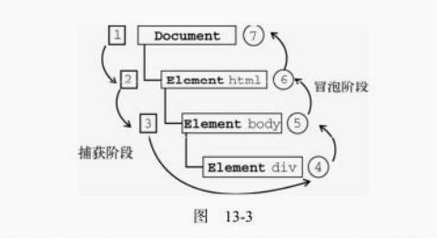

### 13.1.3 DOM事件流
```js
<!DOCTYPE html>
<html lang="en">
<head>
    <meta charset="UTF-8">
    <meta name="viewport" content="width=device-width, initial-scale=1.0">
    <meta http-equiv="X-UA-Compatible" content="ie=edge">
    <title>Document</title>
</head>
<body>
    <div id="myDiv">Click me</div>
</body>
</html>
```

单击`<div>`元素就会发生以下顺序<br>
事件流包括三个阶段：事件捕获阶段、处于目标阶段和事件冒泡阶段。

- 首先发生的是事件捕获，为截获事件提供了机会。
- 然后是实际的目标接收到事件。
- 最后一个阶段是冒泡阶段，可以在这个阶段对事件做出响应。

在DOM事件流中，实际的目标`<div>`在捕获阶段不会接收到事件。这意味着在捕获阶段，事件从document到`<html>`再到`<body>`后就停止了。下一个阶段是"处于目标"阶段，于是事件在`<div>`上发生，并在事件处理中被看成冒泡阶段的一部分。然后，冒泡阶段发生，事件又传播回文档。
### 13.4.1 UI事件
load事件
```js
window.onload = function(){
    var img = new Image();
    img.addEventListener("load",function(){
        console.log("图像加载完毕");
    })
    console.log("这里会继续执行，不会等待上一步执行完毕");
    img.src = "https://img12.360buyimg.com/n1/jfs/t18769/351/1689130359/339221/d48e3755/5ad5c297Na63c5a91.jpg";
    document.body.appendChild(img);
}
```
> 新图像元素不一定要从添加到文档后才开始下载，只要设置了src属性就会开始下载