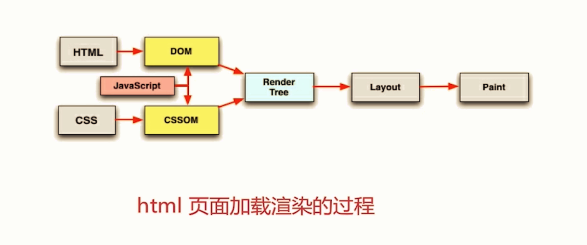

### DOM节点和CSSDOM样式节点加载完成才会去生成RenderTree->Layout->Paint
### 顺序执行、并发加载
- 词法分析：浏览器对HTML文档解析的方式
- 匹配词法分析的顺序是从上到下的，导致HTML的解析的过程是从上到下
- 并发加载：HTML中引入的外部资源是并发请求的，chrome允许并发6个TCP连接
### CSS阻塞
- css head中阻塞页面的渲染 
    因为只有DOM节点和CSSDOM样式节点加载完成才会去生成RenderTree
- css 阻塞JS的执行 
    因为JS执行有可能会操作DOM，有可能会依赖某个css样式
- css 不会阻塞外部脚本的加载
### JS阻塞
- 直接引入的JS会阻塞页面的渲染 
需要等待这些JS加载执行完毕，dom才开始渲染
- JS不阻塞资源的加载，因为浏览器的并发限制规则 
例如IMG资源会并发加载完成，但是会阻塞dom渲染
- JS顺序执行，阻塞后续JS逻辑执行 
例如10个script标签，会依次按顺序执行，其中一个标签里JS执行，报错不会影响其它的script标签JS执行，但是报错的那个script标签里后续的JS不会执行