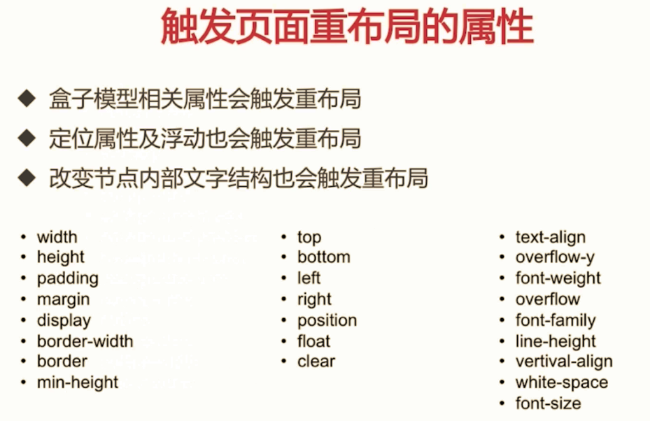
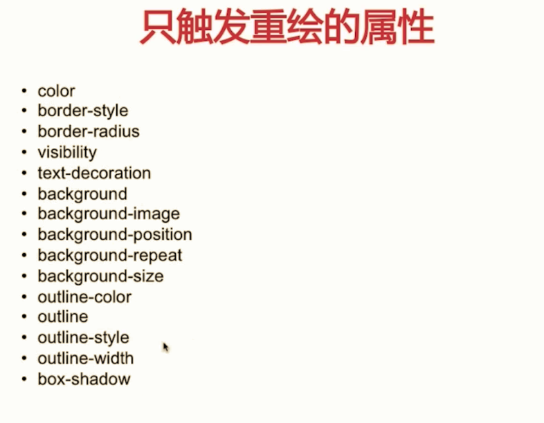
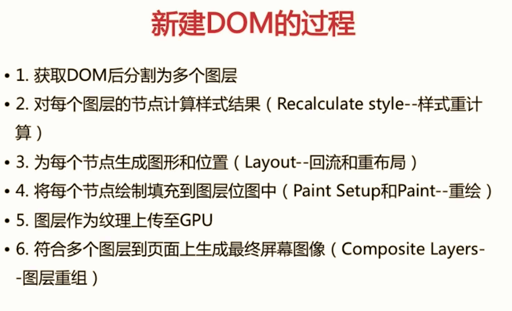
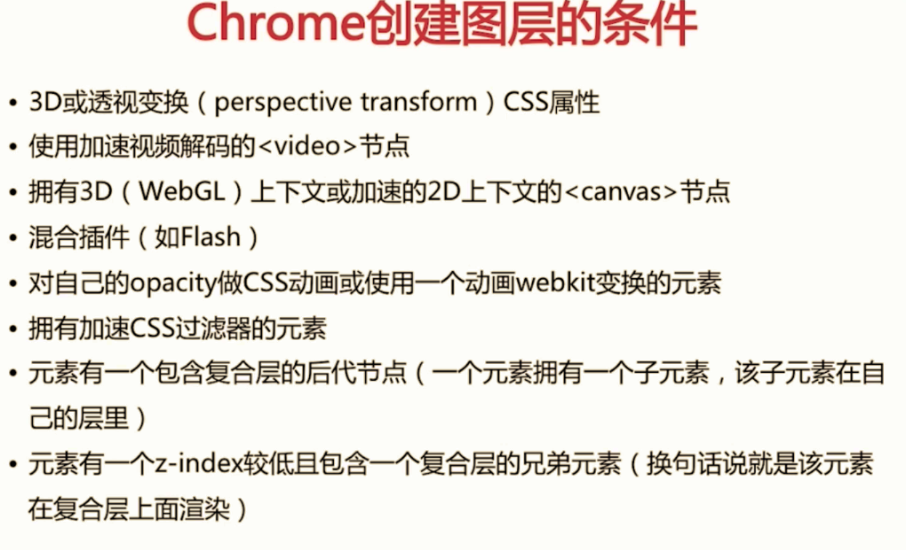

### css性能让js变慢？
真实的浏览器中JavaScript引擎和UI渲染是在单独的线程中工作
- 一个线程 => JavaScript解析
- 一个线程 => Ui渲染

浏览器机制：如果UI线程和JS线程并行执行，有可能JS获取到的布局属性、css不是预期想要的结果，所以UI线程和JS线程是互斥的，例如UI线程在运行，JS线程是被冻结的，反之如此

> 频繁的触发重绘与回流，会导致UI频繁的渲染，最终导致JS变慢

### 回流
- 当render tree中的一部分(或全部)因为元素的规模尺寸，布局，隐藏等改变而需要重新构建。这就称为回流(reflow)
- 当页面布局和几何属性改变时就需要回流
### 重绘
- 当render tree中的一些元素需要更新属性，而这些属性只是影响元素的外观，风格，而不会影响布局的，比如background-color.这就叫重绘
> 回流必将引起重绘，而重绘不一定引起回流
### 避免重绘与回流的两种方法

1. 避免使用触发重绘、回流的css属性
2. 将需要频繁触发回流和重绘的元素限制在单独的图层之内，减少回流与重绘的影响范围 
单独图层css: `transform: translateZ(0) / will-change: transform;` 
单独图层element: `<video> <canvas>`
### 优化总结
